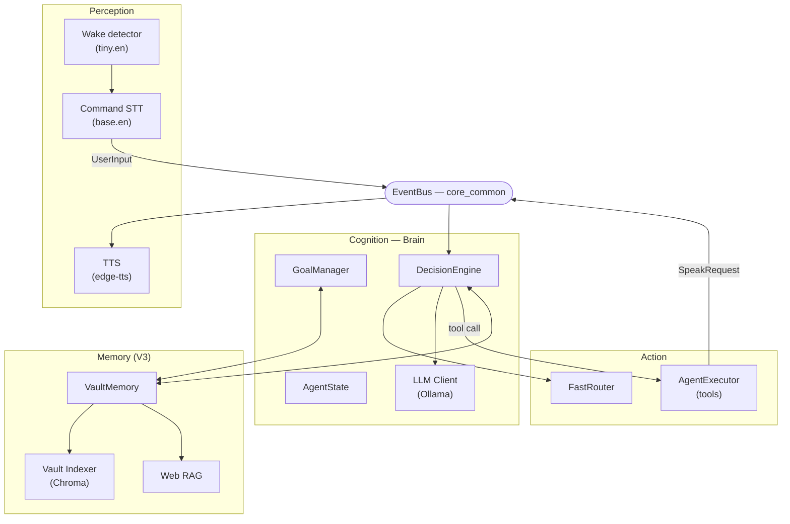
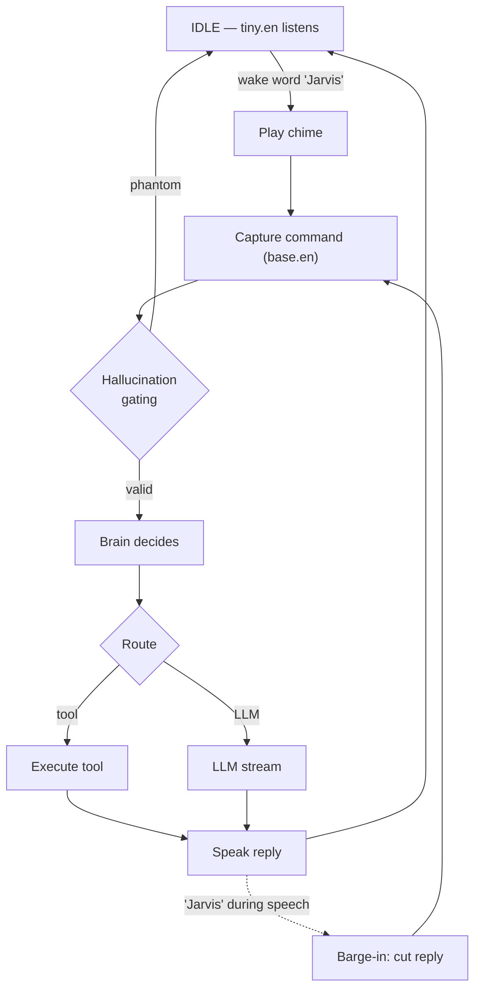
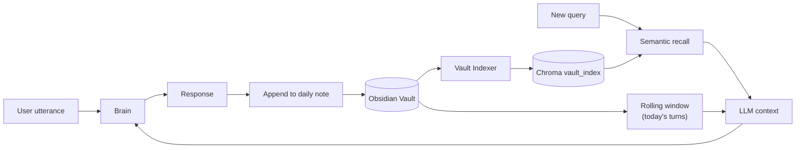
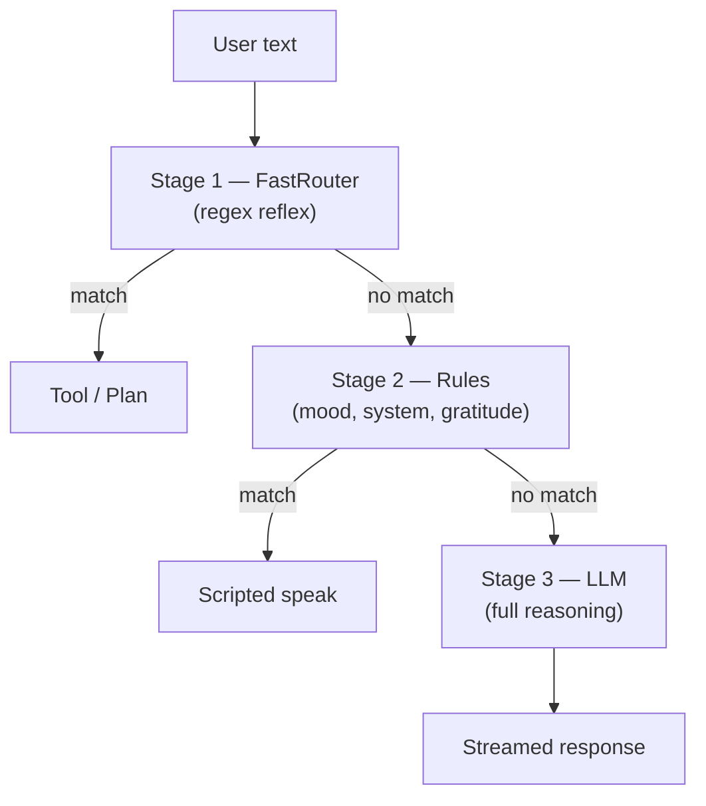

<!--
  JARVIS — Engineering Design Document
  Living document. Update the Revision History table on every material change.
  Where a fact is not yet established, use an explicit [PLACEHOLDER] marker
  rather than inventing detail.
-->

# JARVIS — Engineering Design Document

---

## Cover Page

| Field | Value |
|---|---|
| **Project Name** | JARVIS — Local Voice-Driven AI Assistant |
| **Document Title** | Engineering Design Document |
| **Version** | 0.1 |
| **Author** | Achintya |
| **Date** | 2026-07-05 |
| **Document Status** | Draft |
| **Classification** | Internal / Personal Project |

---

## Revision History

| Version | Date | Author | Summary of Changes |
|---|---|---|---|
| 0.1 | 2026-07-05 | Achintya | Initial document. Establishes project overview, vision, current state, scope, roadmap, and risk register. Baseline for all future documentation. |
| _next_ | _YYYY-MM-DD_ | _—_ | _[Describe changes here]_ |

> **Maintenance policy:** Every material change to scope, architecture, or roadmap
> must add a row to this table and increment the version. Minor edits (typos,
> formatting) do not require a version bump but should be noted in commit history.

---

## Table of Contents

1. [Project Overview](#1-project-overview)
2. [Vision](#2-vision)
3. [Objectives](#3-objectives)
4. [Current Development Status](#4-current-development-status)
5. [Work in Progress](#5-work-in-progress)
6. [Scope](#6-scope)
7. [Roadmap](#7-roadmap)
8. [Risks & Challenges](#8-risks--challenges)
9. [Future Documentation](#9-future-documentation)
10. [Appendix](#10-appendix)

---

## 1. Project Overview

### 1.1 What JARVIS Is

JARVIS is a **local, privacy-first, voice-driven AI assistant** that runs entirely on
the user's own machine. It captures speech, reasons with a locally hosted large language
model, executes real actions on the host system (launching applications, setting timers,
controlling volume, reading/writing files, taking notes), and responds in a synthesized
voice — with no dependency on cloud AI services for its core reasoning loop.

The assistant is modeled, in character and ambition, on the fictional J.A.R.V.I.S. from
the *Iron Man* films: a composed, competent, always-available presence that remembers
context, anticipates needs, and acts on the user's behalf.

### 1.2 Why It Exists

Commercial voice assistants (Alexa, Siri, Google Assistant) are cloud-dependent, send
user data off-device, and are closed to deep customization. Modern LLM assistants are
powerful but live behind a chat window and forget everything between sessions. JARVIS
exists to combine the strengths of both while eliminating their weaknesses:

- **Local and private** — reasoning, memory, and speech all run on-device.
- **Persistent memory** — it remembers across sessions using the user's own knowledge base.
- **Agentic** — it performs real actions, not just conversation.
- **Ambient and voice-first** — it is meant to be spoken to, not typed at.

### 1.3 The Problem It Solves

> *"An assistant that remembers my world, can act on my machine, and talks to me
> naturally — without sending my life to a cloud provider."*

Concretely, JARVIS addresses three gaps:

1. **Memory** — conversations and facts persist and are semantically recalled.
2. **Agency** — it controls the desktop and system through a governed tool interface.
3. **Presence** — a hands-free, wake-word voice loop rather than a chat box.

### 1.4 Intended Users

- **Primary:** The project author, as a daily-driver personal assistant and coding companion.
- **Secondary:** Developers and enthusiasts interested in local-first, agentic AI as a
  reference implementation.
- **Tertiary (aspirational):** Open-source users who want a private, extensible assistant.

---

## 2. Vision

JARVIS aims to become a **genuine daily-driver AI companion** that:

- **Remembers the user's world** — projects, notes, goals, and past conversations, stored
  as inspectable, portable knowledge the user also owns.
- **Codes alongside the user** — reads, writes, and runs code in a governed workspace,
  driven by voice.
- **Converses like the movie** — natural, low-latency, interruptible speech with a
  consistent persona and ambient proactivity.

The long-term north star is an assistant indistinguishable in *feel* from the fictional
JARVIS: present without being intrusive, capable without being dangerous, and personal
without being cloud-bound.

---

## 3. Objectives

### 3.1 Functional Objectives

| ID | Objective |
|---|---|
| F-1 | Reliable hands-free voice interaction (wake word → command → spoken response). |
| F-2 | Persistent, semantically searchable memory across sessions. |
| F-3 | Governed execution of real-world actions (apps, files, system, notes, timers). |
| F-4 | Proactive goal tracking and reminders. |
| F-5 | Grounded factual answers via a curated knowledge corpus. |
| F-6 | A consistent, movie-accurate conversational persona. |

### 3.2 Technical Objectives

| ID | Objective |
|---|---|
| T-1 | Fully local reasoning loop (no cloud LLM dependency). |
| T-2 | Event-driven, loosely coupled architecture with sub-millisecond dispatch. |
| T-3 | A hardened tool-execution surface safe against prompt-injection-driven misuse. |
| T-4 | Reproducible builds, automated tests, and continuous integration. |
| T-5 | Graceful degradation when subsystems (LLM, embeddings, microphone) are unavailable. |
| T-6 | Latency targets: first audio < 1.5 s for tool routes, < 3 s for LLM routes _(target; not yet formally benchmarked — see §8)_. |

---

## 4. Current Development Status

### 4.1 Summary

JARVIS is a **functional, end-to-end assistant** in active development. The reasoning,
memory, action, and voice loops all work. The codebase is approximately **8,000 lines of
application code** plus a **127-case automated test suite**, under continuous integration.
Development currently centers on the third-generation orchestrator (V3), which is the
active target; a stable second-generation orchestrator (V2) remains runnable.

### 4.2 Technologies and Frameworks in Use

| Category | Technology |
|---|---|
| Language / Runtime | Python 3.10+ |
| Local LLM | Ollama (default model `qwen2.5:7b-instruct`, fallback `qwen2.5:3b-instruct`) |
| Speech-to-Text | faster-whisper (`base.en` command capture, `tiny.en` wake detection) |
| Text-to-Speech | edge-tts (neural voices) |
| Embeddings | Ollama `nomic-embed-text` |
| Vector Store | ChromaDB |
| Persistent Memory | Obsidian markdown vault (V3); SQLite + ChromaDB (V2) |
| Audio I/O | sounddevice, miniaudio |
| Desktop Control | pyautogui, pygetwindow, pycaw |
| Testing / QA | pytest, pytest-asyncio, ruff, GitHub Actions CI |
| Packaging | pyproject.toml (pinned dependencies) |

### 4.3 Overall Architecture

JARVIS uses an **event-driven, single-process architecture**. An in-memory `EventBus`
decouples subsystems; thin *adapters* bridge each subsystem to the bus. Shared primitives
(event definitions, the bus, the speaking-state guard) live in a neutral `core_common/`
package used by all orchestrator generations.

```
 ┌─────────────┐   UserInput    ┌──────────────────────────────┐
 │ Perception  │───────────────▶│            Brain             │
 │ wake / STT  │                │  AgentState (mood, intent,   │
 └─────────────┘                │   goals, system load)        │
        ▲                       │  GoalManager (sync, first)   │
        │ SpeakRequest          │  DecisionEngine:             │
        │                       │   FastRouter → Rules → LLM   │
 ┌─────────────┐                └───────────────┬──────────────┘
 │   Action    │◀──── tool calls ───────────────┤
 │ Executor /  │                                 │  LLM stream (Ollama)
 │    TTS      │                                 ▼
 └─────────────┘                ┌──────────────────────────────┐
                                │            Memory            │
                                │  Vault (daily notes, goals,  │
                                │  notes) + Chroma recall +    │
                                │  web-knowledge RAG           │
                                └──────────────────────────────┘
```

**Layered structure:**

| Layer | Package(s) | Responsibility |
|---|---|---|
| Perception | `perception/` | Microphone ownership, wake-word detection, STT, TTS, audio cues |
| Cognition | `cognition/` | Decision engine, agent state, LLM client, goals, memory context, agent-core tool loop |
| Action | `action/` | Fast intent router, tool executor, desktop/web/vault tools |
| Memory | `memory/` | Obsidian vault I/O, semantic indexer, web RAG, shared embedder (V3) |
| Orchestration | `core_v2/`, `core_v3/` | Event-driven Brain that wires the layers together |
| Shared | `core_common/`, `core/`, `infra/` | Event bus/types, configuration, resource monitor |

**Orchestrator generations:**

- **V1** (`legacy/`) — original monolithic assistant. Retired; reference only.
- **V2** (`core_v2/`) — event-driven; SQLite + ChromaDB memory. Stable. Runs via `python main.py`.
- **V3** (`core_v3/`) — event-driven; Obsidian-vault memory, wake-word voice. **Active target.**
  Runs via `python -m core_v3`.

### 4.4 Features Completed

| Area | Completed Capability |
|---|---|
| Voice input | Single-mic wake-word loop; fuzzy wake matching; command capture |
| Voice output | Neural TTS with tunable cadence; queue-based streaming playback |
| Barge-in | Interrupt a spoken reply with the wake word (half-duplex) |
| STT robustness | Whisper hallucination gating (confidence + phantom-phrase filtering) |
| Reasoning | 3-stage decision pipeline: FastRouter (reflex) → rules → local LLM |
| Memory (V3) | Obsidian vault: daily conversation logs + semantic recall across notes |
| Goals | Voice-created goals persisted as Obsidian tasks; proactive reminders |
| Tools | Time, timers, system info, volume, clipboard, app/URL launch, files, shell, notes |
| Knowledge (code) | FineWeb-derived web-knowledge RAG pipeline (index build is a user step) |
| Security | Allowlisted shell, sandboxed file access, fail-closed action confirmation |
| Engineering | Pinned dependencies, 127-test suite, CI, README, lint-clean, `core_common` extraction |

### 4.5 Current Capabilities (User-Facing)

A user can, hands-free: wake JARVIS by voice, ask the time or system status, set timers,
control volume, launch apps and websites, create and search notes, set and complete goals,
have those goals proactively surfaced, ask general questions answered by the local LLM,
and interrupt a reply mid-sentence — all with conversation history persisted to a vault
the user owns.

---

## 5. Work in Progress

### 5.1 Features Under Development

| Item | Status | Notes |
|---|---|---|
| Barge-in reliability tuning | In progress | Improving hit-rate and latency on speaker setups |
| V3 ⇄ V2 cutover (Phase E) | Pending | Retire V2 to `legacy/` once V3 dogfoods cleanly |
| Coding partner (Phase G) | Planned / next major | Voice-driven code read/edit/run in a governed workspace |

### 5.2 Problems Being Solved

- **Speaker-mode barge-in** — reliably catching the wake word over JARVIS's own voice
  without acoustic echo cancellation (see §8, R-1).
- **Turn-taking quality** — ensuring every captured utterance is intentional so the LLM
  is not answering fragments or ambient speech.

### 5.3 Known Limitations

- Barge-in is best-effort on speakers; not yet 100% reliable without headphones or AEC.
- The web-knowledge corpus (RAG) is implemented but not yet built/populated by default.
- Latency targets (T-6) are not yet formally measured or benchmarked.
- Windows-only for desktop-control features.

### 5.4 Technical Blockers

| ID | Blocker | Impact |
|---|---|---|
| B-1 | No acoustic echo cancellation | Caps barge-in reliability on speakers |
| B-2 | Host RAM pressure under full stack | Limits model size / concurrency headroom |
| B-3 | [PLACEHOLDER — record new blockers here] | — |

---

## 6. Scope

### 6.1 In Scope

- Local, single-machine, single-user operation.
- Hands-free wake-word voice interaction.
- Persistent, user-owned memory (Obsidian vault).
- Governed execution of desktop, system, file, and note actions.
- Proactive goal tracking and reminders.
- Local LLM reasoning with optional local web-knowledge grounding.
- A movie-accurate conversational persona.

### 6.2 Out of Scope (Current Phase)

- **Cloud-hosted LLM inference** — reasoning stays local by design.
- **Cross-platform desktop control** — Windows-first; other platforms deferred.
- **Multi-user / multi-device** — single user, single machine.
- **Distributed architecture / message-queue backbone** — in-process is correct at this scale.
- **Model training or fine-tuning** — the value is in the agentic loop, not model training.
- **Full acoustic echo cancellation** — deferred; mitigated by wake-gating + half-duplex.
- **Mobile or web front-ends** — voice-first, local only.

> Items may move from Out of Scope to In Scope in future revisions; such moves must be
> recorded in the Revision History.

---

## 7. Roadmap

### 7.1 Immediate Goals (now)

- Finalize and push the committed codebase to remote version control.
- Complete barge-in reliability tuning for speaker setups.
- Ratify this design document as the documentation baseline.

### 7.2 Short-Term Milestones (next)

- **Phase E — Cutover:** retire V2/V1 to `legacy/`; consolidate to a single (V3) architecture.
- **Phase G — Coding Partner:** governed, voice-driven code editing and execution workspace.
- Formal latency benchmarking against target T-6.

### 7.3 Medium-Term Milestones

- **Voice fidelity:** local voice cloning (e.g. XTTS) with graceful fallback to edge-tts.
- **Integrations:** calendar, media control, and other real-world connectors.
- **Web-knowledge corpus:** build and enable the RAG index by default.
- **Demonstration assets:** benchmarks report and a short demo recording.

### 7.4 Long-Term Vision

- Ambient, always-available presence that volunteers timely, relevant help.
- A rich but safe plugin/tool ecosystem.
- Reliability and polish sufficient for release as an open reference implementation.
- [PLACEHOLDER — additional long-horizon goals as the vision matures.]

---

## 8. Risks & Challenges

| ID | Risk / Challenge | Likelihood | Impact | Mitigation / Status |
|---|---|---|---|---|
| R-1 | Speaker echo caps barge-in reliability (no AEC) | High | Medium | Wake-gating + half-duplex + fuzzy matching; AEC deferred |
| R-2 | Host resource pressure (RAM/VRAM) under full stack | Medium | Medium | Wake-gated STT; smaller fallback model; edge-triggered pressure alerts |
| R-3 | Local LLM quality ceiling vs. cloud models | Medium | Medium | Model-agnostic client; upgrade path as local models improve |
| R-4 | Multi-generation architecture debt (V1/V2/V3) | Medium | Low | `core_common` extraction done; Phase E cutover planned |
| R-5 | Prompt-injection-driven tool misuse | Low | High | Allowlisted shell, sandboxed files, fail-closed confirmation, tests |
| R-6 | Single-machine data durability | Medium | High | Version control; user-owned vault; remote push |
| R-7 | Latency exceeding conversational comfort | Medium | Medium | FastRouter reflex path; benchmarking pending |
| R-8 | [PLACEHOLDER — record new risks here] | — | — | — |

**Open design uncertainties:**

- Whether to invest in full acoustic echo cancellation vs. remaining wake-gated. _(Undecided.)_
- The build-vs-delegate decision for the Phase G coding capability. _(To be decided at Phase G.)_

---

## 9. Future Documentation

This document is the root of a planned documentation suite. The following documents should
be authored as their subjects stabilize:

| Planned Document | Purpose | Priority |
|---|---|---|
| Architecture Specification | Detailed component design, event catalog, data flow | High |
| Voice & Perception System | Wake loop, STT/TTS pipeline, barge-in, audio tuning | High |
| Memory System | Vault schema, indexing, recall, retention | High |
| AI Models & Reasoning | Model selection, prompts, decision pipeline | Medium |
| Tool / Action Reference | Full tool catalog, arguments, permissions | Medium |
| Security Model | Threat model, sandboxing, confirmation policy | Medium |
| Testing Strategy | Test taxonomy, coverage goals, CI policy | Medium |
| Deployment & Setup Guide | Installation, prerequisites, configuration | Medium |
| Hardware Integration | Microphone/audio device requirements and tuning | Low |
| Plugin / Extension Guide | How to add new tools and integrations | Low |
| Benchmarks & Metrics | Latency, routing accuracy, STT accuracy | Low |

---

## 10. Appendix

### 10.A System Architecture Diagram



### 10.B Voice Interaction Flowchart



### 10.C Memory Data-Flow Diagram



### 10.D Decision Pipeline Diagram



### 10.E Directory / Module Map

```text
jarvis_v1/
├── core_common/      Shared primitives: EventBus, event types, SpeakingGuard
├── core/             Configuration
├── infra/            Resource monitor (CPU/RAM/VRAM pressure)
├── perception/       Wake detection, STT, TTS, audio cues
├── cognition/        Decision engine, agent state, LLM client, goals, memory ctx
│   └── agent_core/   Multi-turn tool-use loop (planner / parser / schema)
├── action/           FastRouter, AgentExecutor, desktop / web / vault tools
├── memory/           (V3) Vault I/O, indexer, web RAG, shared embedder
├── core_v2/          V2 orchestrator (stable)
├── core_v3/          V3 orchestrator (active target)
├── data/             Offline FineWeb pipeline + blocklists
├── tests/            Automated test suite (pytest)
├── tools/            Developer utilities (e.g. voice A/B tester)
├── legacy/           V1 orchestrator (reference only)
└── docs/             Engineering documentation (this document)
```

### 10.F Screenshots / Demonstrations
> [PLACEHOLDER — screenshots, terminal captures, and demo recordings to be inserted.]

### 10.G Glossary
| Term | Definition |
|---|---|
| Wake word | The spoken trigger ("Jarvis") that begins a command capture. |
| Barge-in | Interrupting an in-progress spoken reply by speaking. |
| Half-duplex | Listening and speaking are mutually exclusive to avoid self-hearing. |
| Vault | The user's Obsidian markdown knowledge base used as JARVIS's memory. |
| RAG | Retrieval-Augmented Generation — grounding answers in a retrieved corpus. |
| FastRouter | The zero-latency regex-based intent router (reflex stage). |
| Orchestrator | The `Brain` component that wires perception, cognition, action, and memory. |

### 10.H References
> [PLACEHOLDER — links to source repository, related documents, and external tools.]

---

*End of Document — JARVIS Engineering Design Document, Version 0.1 (Draft).*
